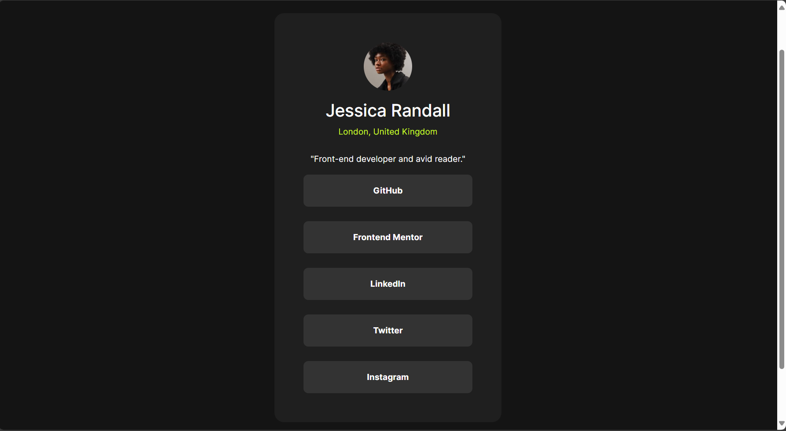
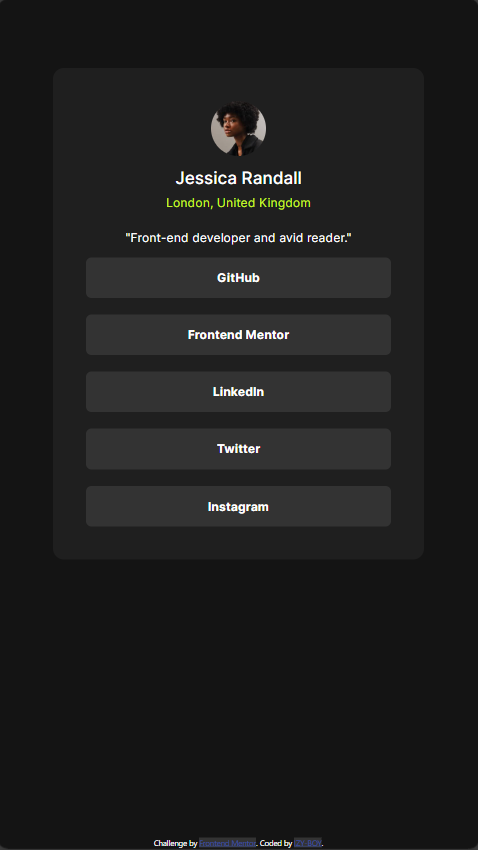
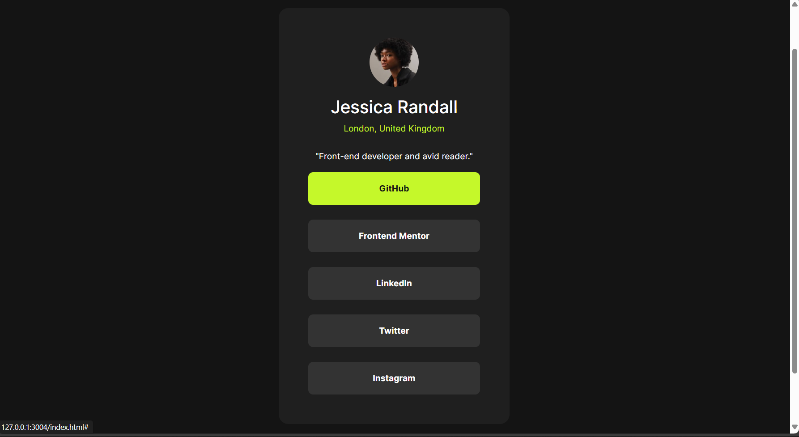

# Frontend Mentor - Social links profile solution

This is a solution to the [Social links profile challenge on Frontend Mentor](https://www.frontendmentor.io/challenges/social-links-profile-UG32l9m6dQ). Frontend Mentor challenges help you improve your coding skills by building realistic projects. 

## Table of contents

  - [Screenshot](#screenshot)
  - [Links](#links)
  - [Built with](#built-with)
  - [What I learned](#what-i-learned)
- [Author](#author)

### Screenshot





### Links

- Solution URL:(https://your-solution-url.com)
- Live Site URL:(https://your-live-site-url.com)

### Built with

- Semantic HTML5 markup
- CSS custom properties
- Bootstrap-5.3.3 css
- CSS Grid

### What I learned

```html
<main class=" text-center container mx-auto p-5 rounded-4 inter ">
    
    <h3 class="text-white">Jessica Randall</h3>
    <p class="green mb-4">London, United Kingdom</p>
    <p class="text-white">"Front-end developer and avid reader."</p>
    <div >
      <a class="page-link rounded-3 fw-bold text-white mb-4 py-3" href="#">GitHub</a>
      <a class="page-link rounded-3 fw-bold text-white mb-4 py-3" href="#">Frontend Mentor</a>
      <a class="page-link rounded-3 fw-bold text-white mb-4 py-3" href="#">LinkedIn</a>
      <a class="page-link rounded-3 fw-bold text-white mb-4 py-3" href="#">Twitter</a>
      <a class="page-link rounded-3 fw-bold text-white py-3" href="#">Instagram</a>
    </div>
  </main>
```
```css
:root{

    /* Colors */
    
    /* Primary */
    
    --Green: hsl(75, 94%, 57%);
    
    /* Neutral */
    
    --White: hsl(0, 0%, 100%);
    --Grey: hsl(0, 0%, 20%);
    --Dark-Grey: hsl(0, 0%, 12%);
    --Off-Black: hsl(0, 0%, 8%);

    /* Typography */

    --font-size-desktop: 14px;
    --font-size-mobile: 18px;
}
```

## Author

- Frontend Mentor - (https://www.frontendmentor.io/profile/IZY-BOY)
